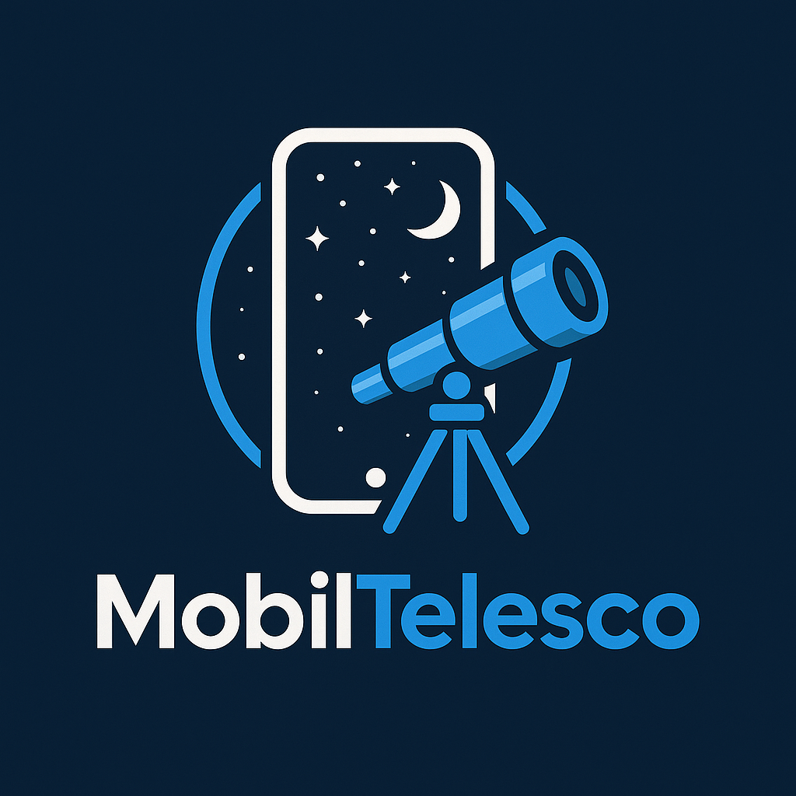

# MobilTelesco: A Smartphone-Based Astrophotography Dataset

MobilTelesco is a pioneering, open-access dataset featuring astrophotography images captured using **affordable smartphone setups**. This project explores how modern consumer devices—paired with basic stabilization techniques—can democratize sky observation and contribute to citizen-led astronomical research and machine learning applications.
---

## 🌌 Overview

Smartphone sensors have advanced to the point where, with some patience and long-exposure apps, they can image stars, constellations, and even the Milky Way. MobilTelesco documents this capability across multiple nights, locations, and devices, showcasing what can be achieved with:
- Minimal budget
- No professional telescope
- Passion for the night sky and open-source science

This dataset was used in the paper **“Evaluating Deep Learning Models on Smartphone-Based Astrophotography”**, accepted at **CAIP 2025** (Computer Analysis of Images and Patterns).

---
### 📁 Dataset Structure

<details>
<summary>Click to expand full directory layout</summary>

```
MobilTelesco/
├── DATA/
│   ├── Unlabelled/
│   │   ├── 20sEXP/
│   │   │   ├── 10-Mar-2025/
│   │   │   │   ├── 10marrun1/
│   │   │   │   │   ├── LIGHTS/           # Raw light frames (.dng)
│   │   │   │   │   ├── SkyMap/           # Sky reference frames
│   │   │   │   │   │   ├── Start.jpg
│   │   │   │   │   │   └── End.jpg
│   │   │   │   │   └── Compressed/       # Compressed .jpg version
│   │   │   ├── 16-Mar-2025/
│   │   │   ├── 17-Mar-2025/
│   │   │   └── ...
│   │   ├── 30sEXP/
│   │   │   ├── 04-Jan-2025/
│   │   │   │   ├── 4janrun1/
│   │   │   │   │   ├── DARKS/            # Raw dark frames (.dng)
│   │   │   │   │   ├── LIGHTS/           # Raw light frames (.dng)
│   │   │   │   │   ├── SkyMap/
│   │   │   │   │   │   ├── Start.jpg
│   │   │   │   │   │   └── End.jpg
│   │   │   │   │   └── Compressed/
│   │   │   │   │       ├── DARKS/        # Compressed darks (.jpg)
│   │   │   │   │       └── LIGHTS/       # Compressed lights (.jpg)
│   │   │   ├── 4janrun2/
│   │   │   ├── 05-Jan-2025/
│   │   │   └── ...
│   │   ├── RAWonly/
│   │   │   ├── 02-Dec-2024/
│   │   │   │   ├── 2decrun1/
│   │   │   │   │   ├── DARKS/
│   │   │   │   │   ├── LIGHTS/
│   │   │   │   │   └── SkyMap/
│   │   │   │   ├── 2decrun2/
│   │   │   │   │   ├── DARKS/
│   │   │   │   │   ├── LIGHTS/
│   │   │   │   │   └── SkyMap/
│   │   │   ├── 03-Dec-2024/
│   │   │   ├── 04-Dec-2024/
│   │   │   └── ...
│
│   ├── Labelled/
│   │   └── 8-Classes/
│   │       ├── 04-Jan-2025/
│   │       │   ├── IMG_*.jpg            # Input images
│   │       │   └── IMG_*.txt            # YOLO-style class labels
│   │       ├── 05-Jan-2025/
│   │       ├── 1-Feb-2025/
│   │       └── ...
│
├── LICENSE         # CC-BY 4.0 License
├── 8_classes.txt   # Label key for the 8 classes version 
├── 26_classes.txt  # Label key for the 26 classes version 
└── README.md       # Project overview, usage, citation

```

</details>


---

🧾 Notes
Unlabelled/: Raw and compressed astrophotography runs across different dates and exposure settings (20s, 30s, RAW-only), main dataset.

Labelled/8-Classes/: Labelled data. Every .jpg has an associated .txt file.

SkyMap/: Contains snapshots of the sky at the beginning and end of each session.

Compressed/: Optimized versions of raw .dng images that are primarly used for labelling. 

---

## 💡 Use Cases
MobilTelesco can serve multiple research and outreach purposes:
- 📸 **Low-Cost Astronomy Education** – For schools or institutions lacking telescope access
- 🤖 **Computer Vision & ML Training** – Train models for star detection, sky enhancement
- 🌍 **Citizen Science & Outreach** – Promote accessible science across developing regions
- 📊 **Comparative Benchmarking** – Compare smartphone results with professional telescopes

---

## 📜 License

This dataset is licensed under the **Creative Commons Attribution 4.0 International (CC BY 4.0)** license.  
You are free to:
- Use, share, and adapt the data
- Even for commercial purposes  
**But you must give appropriate credit** to the dataset author.
---

## 📚 Citation

If you use this dataset in your work, please cite:

Shantanusinh Parmar. (2025). MobilTelesco: A Smartphone-Based Astrophotography Dataset. Zenodo.

---

## 🚀 Background & Motivation

As an undergraduate with limited access to astronomical hardware, I was curious: *What can a smartphone see of the universe?*  
This dataset was born from dozens of night sessions under Indian skies, using nothing but:
- A smartphone
- A tripod
- The curiosity to explore

This project also highlights the importance of **open data**, **low-resource innovation**, and **inclusive research tools** in STEM.

---

## 🧠 Related Work

This dataset was used in:
- **"Evaluating Deep Learning Models on Smartphone-Based Astrophotography"**, CAIP 2025  
(Accepted paper exploring CNN-based enhancement of smartphone night sky images.)

---

## 🤝 Contributing & Contact

I welcome:
- Collaborations on image analysis or model training
- Contributions of new smartphone images to expand the dataset
- Educational or citizen science outreach projects

📬 **Shan Parmar**  
📧 Email: *shantanu.c.parmar@gmail.cpm*  
🌐 Website: https://shantanu-parmar.github.io/  
GitHub: https://github.com/Shantanu-Parmar

---

## 🖼️ Preview

<p align="center">
  
</p>

<p align="center"><em>“A telescope in your pocket. The universe on your screen.”</em></p>
---

## 🙏 Acknowledgements

Special thanks to:
-- Ms. Sophia Bhatti (UPenn)
-- Ms. Maria Pasayalo (UofF)
---
